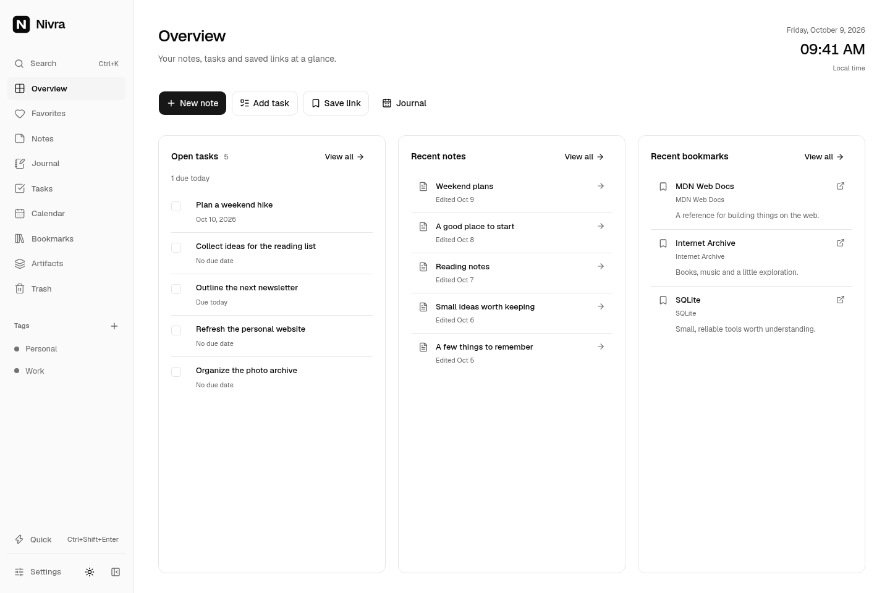
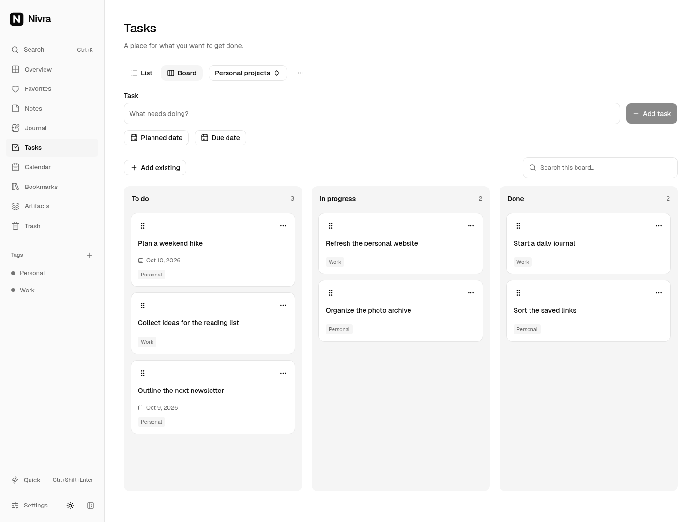

# Nivra

**Your thoughts, together.**

Nivra brings notes, journals, tasks, bookmarks and files into one quiet workspace. Plan with Calendar and Kanban, find things with full-text search, and connect your AI agents through MCP.



- **Write and collect:** rich-text notes, drawings, attachments, bookmarks, tags, favourites and searchable artifacts with background OCR and thumbnails.
- **Plan:** daily journals, task dates, recurring tasks, Kanban boards, calendar events and push reminders.
- **Connect:** MCP at `/mcp`, with API keys or OAuth, read-only or read/write access, and exact counts alongside paginated tools.
- **Keep it yours:** one owner, passkey or password login, optional TOTP, encryption at rest and encrypted backups. Use the browser or install the PWA. Editing requires a connection.

<details>
<summary>See the Kanban board</summary>



Screenshots use demo content.

</details>

## Get started with Docker

Requires Docker with Compose. Build and run from this repository:

```sh
git clone https://github.com/Harsh-2002/Nivra.git
cd Nivra
docker compose up -d --build
```

Open **<http://localhost:3000>**, create your owner account and save the recovery code. No environment configuration is required for local use. The included [compose.yaml](compose.yaml) persists your database, files and generated keys in a named volume.

For HTTPS behind a reverse proxy:

```sh
NIVRA_PUBLIC_URL=https://notes.example.com docker compose up -d --build
```

Use `NIVRA_PORT=3001` to publish a different host port. Complete onboarding before exposing a fresh installation to other people: Nivra has one owner, and later signup is disabled. Save the recovery code. Passkeys and browser notifications require HTTPS or localhost; an email-shaped username does not enable email delivery.

## Configuration

All three deployment settings are optional. Copy [.env.example](.env.example) to `.env` when needed.

| Variable                    | Default                          | Purpose                                       |
| --------------------------- | -------------------------------- | --------------------------------------------- |
| `NIVRA_PORT`                | `3000`                           | Host port published by Compose.               |
| `NIVRA_PUBLIC_URL`          | Address saved during setup       | Explicit public origin for a reverse proxy.   |
| `NIVRA_ENCRYPTION_KEY_FILE` | Generated key in the data volume | Mounted external key containing 32 raw bytes. |

Choose encryption during account setup; it defaults on and cannot change after initialization. **Settings → System** manages local/S3 storage, the upload limit (25 MiB by default), and backup scheduling/retention (daily, seven copies). S3 credentials are verified before activation and stored encrypted. Files and optional S3 backups share one connection and bucket, separated into `nivra/` and `nivra-backups/`. Changing storage transfers existing files in the background while preserving the source. Appearance is in the sidebar; account security, notifications and MCP have their own settings.

The container listens on `0.0.0.0:3000` and stores data at `/app/data`. To use a host directory, replace the named-volume entry in Compose with:

```yaml
volumes:
  - /srv/nivra:/app/data
```

The directory must be writable by container UID 1000. An external key file also needs a read-only container mount; set `NIVRA_ENCRYPTION_KEY_FILE` to its container path. Keep the exact existing volume or directory when upgrading. A reverse proxy must preserve the host; use HTTPS at the domain root, with WebSocket forwarding for development. Subpath hosting is unsupported.

## Updates and recovery

Create and verify an instance backup in **Settings → System**, retain the original encryption key separately, then update the checkout and run `docker compose up -d --build`. Never delete the data volume to fix startup.

For an existing development installation using the retired storage/backup environment variables, stop Nivra and run `npx tsx scripts/migrate-configuration.ts` once before restarting. Keep the original data mount and key; verify the imported settings before removing the retired variables.

Instance backups preserve account security, publications, configuration and referenced files. They remain encrypted even when content encryption is disabled. The master key is never included in remote backup objects. Local backups share the server's failure risk; use S3 or a separately mounted backup directory for host-failure recovery.

With Node.js 24, the recovery CLI supports:

```sh
npm run backup -- create
npm run backup -- list
npm run backup -- verify BACKUP_ID
NIVRA_ENCRYPTION_KEY_FILE=/safe/original.key npm run backup -- restore BACKUP_ID /srv/nivra-restored
```

If the original database is unavailable, append `--backup-directory /safe/backups` for local recovery, or `--connection-file /safe/s3.json` for S3. The private JSON file contains `provider`, `endpoint`, `region`, `bucket`, `accessKeyId`, `secretAccessKey` and `pathStyle`, matching your saved connection. Keep it readable only by its owner.

Restoration requires an empty destination and restores files locally. Content import/export bundles are separate from full-instance recovery. Keep keys, connection credentials and recovery codes outside Git.

[Architecture](docs/architecture.md) · [MCP](docs/mcp.md) · [Testing](docs/testing.md)

MIT licensed. See [LICENSE](LICENSE) and [third-party notices](docs/third-party.md).

## Development

Requires **Node.js 24** and npm. From a cloned checkout:

```sh
npm ci
npm run dev
```

Open <http://localhost:3000>. Install FFmpeg on the host for video thumbnails; Docker includes it. For hot reload behind a domain, set `NIVRA_PUBLIC_URL` and forward WebSocket upgrades through the proxy.

```sh
npm run typecheck
npm run lint
npm run format:check
npm run verify:branding
npm test
npm run build
```

Next.js · TypeScript · shadcn/ui · Tailwind CSS · BlockNote · SQLite/FTS5 · Drizzle · Better Auth. See [CONTRIBUTING.md](CONTRIBUTING.md) before making changes.
